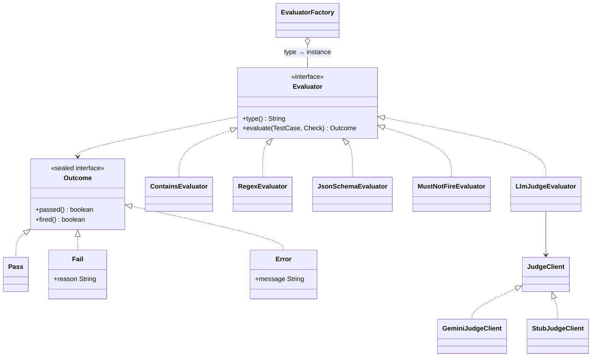

# agent-eval-java


[](https://github.com/Sim2200/agent-eval-java/actions)

A service that runs evaluation suites against AI agent outputs. A suite is a YAML list of cases
(input, agent output, checks). The service runs every case N times with a concurrency bound, bands
each case as stable pass / flaky / stable fail, reports per check type how precise and how complete
its alerts were, and diffs two runs to show which cases regressed.

It is a Java redesign of a Python regression harness I built for an LLM-judge rule set at work, made
small enough to finish and defend: strategy-pattern evaluators, a sealed outcome type, repeat-N
banded scoring, must-not-fire negative assertions, virtual-thread execution, PostgreSQL persistence,
and a benchmark of virtual threads against platform pools. `INTERVIEW.md` explains every design
choice in plain words. Every number below comes from a file under `results/`.

## Architecture

```mermaid
flowchart LR
    Y[Suite YAML] -->|POST /suites| P[SuiteParser]
    P --> S[(PostgreSQL<br/>suites · runs · case_results)]
    R[POST /runs<br/>suiteId, repeat, concurrency] --> RS[RunService]
    RS --> PR[ParallelRunner<br/>virtual thread per case × repeat<br/>Semaphore(concurrency)]
    PR --> CE[CaseExecutor]
    CE --> F[EvaluatorFactory]
    F --> E1[contains] & E2[regex] & E3[json_schema] & E4[must_not_fire] & E5[llm_judge]
    E5 --> J{JudgeClient}
    J -->|GEMINI_API_KEY set| G[Gemini]
    J -->|otherwise| ST[Stub judge]
    PR --> SC[Scorer<br/>repeat-N bands]
    SC --> SUM[RunSummary<br/>bands + fire precision/recall]
    SUM --> S
    S -->|GET /runs/id| SUM
    S -->|GET /runs/a/diff/b| D[RunDiff<br/>regressed · improved]
```

### The evaluator hierarchy



Records for the values (`TestCase`, `Check`, `CheckResult`, `CaseResult`), a sealed interface for
the three outcomes, one class per check type behind one interface, and a factory that Spring fills
with every `Evaluator` bean. `Error` is not `Fail`: a check that could not run has not found a
problem, and is never counted as a fire.

## How a run is scored

- A check **fires** when it returns `Fail`. Each check in a suite carries ground truth,
  `should_pass` (default true); `should_pass: false` marks a deliberate negative example where the
  check is expected to fire. From that the run reports, per check type, **precision** (of the fires,
  how many were right) and **recall** (of the cases that should have fired, how many did): false
  fires and missed fires, the two ways a monitoring rule goes wrong.
- A case passes an execution when every check's fire/no-fire matches its ground truth.
- **Repeat-N banded scoring**: every case runs N times (default 3). Stable pass if it passed at
  least ⌈2N/3⌉ times (2 of 3), stable fail if never, flaky in between.
- `GET /runs/{a}/diff/{b}` lists cases whose band got worse (regressed) or better (improved).

## Results

### Tests and coverage (`results/coverage.json`)

| Measure | Value |
|---|---|
| JUnit 5 tests | **90** (0 failures, 0 errors, 0 skipped) |
| Line coverage (JaCoCo) | **84.7%** (432 of 510 lines) |
| Branch coverage | 83.2% |
| Instruction coverage | 86.3% |
| Excluded from measurement | the benchmark package and the `main` class |

Unit tests use Mockito for the judge client and evaluator faults; the API test runs against a real
PostgreSQL 16 in Testcontainers, so Flyway and the JPA mappings are exercised, not mocked.

### Virtual threads vs platform pools (`results/benchmark.json`, `results/benchmark_bound1000.json`)

Simulated I/O-bound judge: each case sleeps 50-200 ms. The same `ParallelRunner` code, the same
semaphore bound, three executors. Three timed repeats after a warm-up; medians shown. Java 21.0.12,
12 CPUs.

| Bound · cases | Executor | Cases / s (median) | p95 per case |
|---|---|---|---|
| 200 · 2,000 | virtual threads | **1,460.9** | 193 ms |
| 200 · 2,000 | platform pool, 200 threads | 1,418.4 | 196 ms |
| 200 · 2,000 | platform pool, 32 threads | 246.3 | 196 ms |
| 1,000 · 10,000 | virtual threads | **7,204.6** | 193 ms |
| 1,000 · 10,000 | platform pool, 1,000 threads | 6,798.1 | 196 ms |
| 1,000 · 10,000 | platform pool, 32 threads | 247.1 | 196 ms |

What it shows: throughput is set by the concurrency bound, not by the executor. A platform pool
sized to the bound keeps up with virtual threads; a 32-thread pool, a common default, gets about a
sixth of the throughput at bound 200 and a thirtieth at bound 1,000 because only 32 permits can ever
be in use. Virtual threads make the bound the only number to choose. Per-case p95 is the sleep
distribution in every row, which is the expected result: the executor adds no latency, it only
decides how many cases are in flight. Limits: `Thread.sleep` is not a network, the cases are
uniform, and this ran on a laptop.

### The suites through the API (`results/suite_runs.json`)

Each suite was posted and run twice with `repeat: 3, concurrency: 32` against the Docker Compose
stack, stub judge:

| Suite | Cases | Executions | Stable pass / flaky / fail | Fires: precision / recall | Run wall time | HTTP round trip |
|---|---|---|---|---|---|---|
| booking-agent | 65 | 195 | 65 / 0 / 0 | contains 1.0 / 1.0 (15 true fires) · must_not_fire 1.0 / 1.0 (18) | 12-14 ms | 291-499 ms |
| tool-calling-agent | 50 | 150 | 50 / 0 / 0 | json_schema 1.0 / 1.0 (21) · regex 1.0 / 1.0 (9) · must_not_fire 1.0 / 1.0 (9) | 4-55 ms | 208-367 ms |
| summarizer | 45 | 135 | 45 / 0 / 0 | must_not_fire 1.0 / 1.0 (27) · llm_judge no fires expected, none fired | 1-2 ms | 104-145 ms |

The suites are synthetic and consistent by construction (34 deliberate negatives across 160 cases),
so 1.0 / 1.0 is the expected result: it verifies the plumbing, not the agent. The diff of the two
booking runs compared 65 cases with 0 regressed and 0 improved, which is also expected for a
deterministic judge. With Gemini as the judge the same suites would produce flaky cases; that band
is the reason the scorer exists. Wall time is evaluation only; the HTTP round trip includes JSON
serialisation of 195 case results and the PostgreSQL writes.

## Running it

```bash
docker compose up --build            # app on :8080 + PostgreSQL 16; Flyway migrates on start
curl -s -X POST localhost:8080/suites -H 'Content-Type: text/yaml' --data-binary @suites/booking-agent.yaml
curl -s -X POST localhost:8080/runs -H 'Content-Type: application/json' -d '{"suiteId":"booking-agent","repeat":3,"concurrency":32}'
curl -s localhost:8080/runs/1 ; curl -s localhost:8080/runs/1/diff/2
open http://localhost:8080/swagger-ui.html    # OpenAPI UI
scripts/smoke.sh                               # posts and runs all three suites, prints a diff

GEMINI_API_KEY=... docker compose up          # real LLM judge; the key is read from the environment only
```

Build and test locally (JDK 21, Maven, Docker running for Testcontainers):

```bash
mvn verify                       # tests + JaCoCo report (target/site/jacoco) + Spotless check
python3 scripts/coverage_json.py # -> results/coverage.json
java -cp target/classes:$(mvn -q dependency:build-classpath -Dmdep.outputFile=/dev/stdout) \
     io.github.sim2200.agenteval.benchmark.ThreadBenchmark 2000 200 3   # -> results/benchmark.json
```

Docker Desktop 29 on macOS rejects the API version Testcontainers 1.21 negotiates by default; export
`DOCKER_API_VERSION=1.44` and pass `-Dapi.version=1.44` to Maven until that is fixed upstream. CI
(GitHub Actions, Ubuntu) needs no such setting.

## Layout

```
src/main/java/io/github/sim2200/agenteval/
  domain/        TestCase · Check · CheckResult · CaseResult (records) · Outcome (sealed: Pass, Fail, Error)
  evaluator/     Evaluator · Contains · Regex · JsonSchema · MustNotFire · LlmJudge · EvaluatorFactory · JudgeClient (Gemini, Stub) · JudgeConfig
  scoring/       Scorer (repeat-N bands)
  suite/         SuiteParser (YAML)
  run/           CaseExecutor · ParallelRunner (virtual threads + semaphore) · RunSummary · RunDiff · RunService
  persistence/   SuiteEntity · RunEntity · CaseResultEntity · repositories;  resources/db/migration/V1__*.sql
  api/           ApiController (POST /suites, POST /runs, GET /runs/{id}, GET /runs/{id}/diff/{other}) · ApiErrorHandler
  benchmark/     ThreadBenchmark
src/test/java/   90 tests: unit (JUnit 5 + Mockito) and ApiIntegrationTest (Testcontainers PostgreSQL)
suites/          booking-agent.yaml (65) · tool-calling-agent.yaml (50) · summarizer.yaml (45), all synthetic
results/         coverage.json · benchmark.json · benchmark_bound1000.json · suite_runs.json
scripts/         coverage_json.py · smoke.sh
```

## Author

**Simran Kharbanda** · [github.com/Sim2200](https://github.com/Sim2200)
